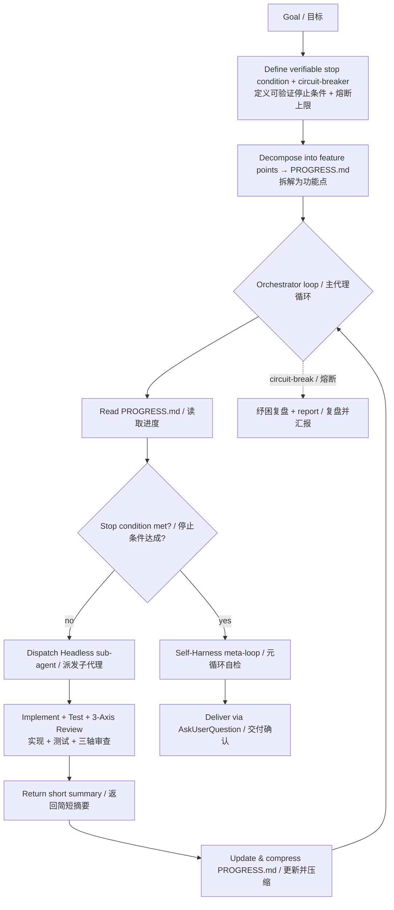

# Loop Engineering · 循环工程

> Make any coding agent autonomously loop a goal into shipped, tested, and reviewed features — then improve itself.
> 让任意编程智能体把一个目标自主循环成「已测试、已审查、可交付」的功能，并在每次任务后自我改进。

[](https://github.com/XuanRuiMu/loop-engineering/stargazers)
[](LICENSE)
[](https://github.com/XuanRuiMu/loop-engineering/commits/main)
[](https://github.com/XuanRuiMu/loop-engineering/issues)
[](https://github.com/XuanRuiMu/loop-engineering)
[](https://github.com/XuanRuiMu/loop-engineering/topics)

**Loop Engineering** is a methodology + skill pack that turns a coding agent from a "one-shot assistant" into an **autonomous engineering loop**. You set a goal; it breaks the goal into feature points, dispatches fresh-context sub-agents to implement each one, verifies with tests, runs a three-axis code review, circuit-breaks on runaway loops, and — after every task — runs a meta-loop that **improves its own rules**.

**循环工程** 是一套「方法论 + 技能包」。它把编程智能体从「一次性的助手」变成**自主工程循环**：你给目标，它把目标拆成功能点，派发全新上下文的子代理逐个实现，用测试验证、用三轴审查把关、用熔断机制防止死循环，并在每次任务后用元循环**自我改进自身的规则**。

---

## What it looks like · 运行效果



A real session, condensed:

```
You ❯ loop: fix every failing test in this plugin, don't stop until green

↻ Loop Engineering started
  ▸ Phase 1  Goal: all tests pass · stop = 0 failures · breaker = 30 loops
  ▸ Phase 2  12 feature points written to PROGRESS.md
  ▸ Phase 3  autonomous loop…
     FP-01  sub-agent → TDD + tests      ✅ 14/14  (summarized, context freed)
     FP-02  sub-agent → TDD + tests      ✅ 11/11  (summarized, context freed)
     FP-07  sub-agent → blocked, retried 5× → circuit-break ⚡
             → 纾困复盘: wrong API was assumed → re-planned
     FP-07  re-dispatched (fresh context) → ✅ 9/9
     … 10/12 done, 2 skipped (out of scope)
  ▸ Phase 4  Self-Harness: found 1 weakness → auto-patched a harness rule
  ✓ Delivered: 10 done · 2 skipped · 0 blocked · loops used 14 / 30
```

---

## Why this exists · 为什么需要它

**The problem.** Coding agents are great for one file and terrible for "finish the whole project." They lose context, drift off-scope, loop forever on a bug, skip tests, and never get better at being an agent.

**核心问题**：智能体改一个文件很在行，但「把整个项目做完」就不行了——上下文会爆、范围会漂、会在一个 bug 上死循环、会跳过测试，而且永远不会「越用越会干」。

**The fix.** Loop Engineering externalizes project state into a tiny `PROGRESS.md` (only what's needed *now*), runs each feature point in a **fresh-context sub-agent** (so the main thread never bloats), enforces tests + review before anything counts as done, and adds a **circuit-breaker** plus a **self-improving meta-loop**.

**解法**：循环工程把项目状态外置到一个极小的 `PROGRESS.md`（只保留「现在需要什么」），每个功能点都在**全新上下文的子代理**里跑（主线程永不膨胀），强制「先测试+审查才算完成」，并加入**熔断机制**与**自我改进的元循环**。

---

## What it does · 能力一览

- **Autonomous loop** — Orchestrator dispatches Headless sub-agents; you only stop in three cases: blocked, circuit-break, or done.
  自主循环：主代理派发子代理，只有「阻塞 / 熔断 / 完成」三种情况才停下找你。
- **Context-wall proof** — State lives in `PROGRESS.md`, not in any LLM window. Sub-agents use fresh contexts and return only short summaries.
  抗上下文爆炸：状态在文件里，不在对话里；子代理用全新上下文，只回简短摘要。
- **Verifiable stop conditions** — "optimize it" is rejected; "all tests pass + lint clean" is required.
  可验证停止条件：拒绝「优化一下」这种模糊目标，必须是「测试全过 + lint 零报错」。
- **Circuit-breaker** — Same bug fixed 5× → skip. Total loops hit cap → stop and report. No infinite loops.
  熔断机制：同一问题修 5 次仍失败就跳过；总轮次到上限就停下汇报。不死循环。
- **Three-axis review (mandatory)** — Standards + Spec + BlindSpot, run as parallel sub-agents, never skipped.
  三轴审查（强制）：规范轴 + 规格轴 + 盲区轴，并行子代理执行，绝不跳过。
- **Self-Harness meta-loop** — After each task, it mines its own failure patterns and patches its own rules (graded auto / confirm / forbidden).
  元循环自检：每次任务后挖掘自身失败模式，按级别自动/待确认/禁止自动地改进自身 harness。
- **Contract coordination** — Cross-feature API/schema changes are tracked as deltas so parallel sub-agents don't build on stale assumptions.
  契约协调：跨功能点的公开契约变更以增量记录，避免并行子代理基于旧假设实现。

---

## Quick start · 安装

The `skills/` folder contains 9 ready-to-use skills. Copy them into your agent's skills directory — no build step, no dependencies.

`skills/` 目录内含 9 个开箱即用的技能。把它们复制进你的智能体技能目录即可，无需构建、无依赖。

| Agent | Where to copy |
| --- | --- |
| **CodeBuddy / WorkBuddy** | `.agents/skills/` |
| **Claude Code** | `skills/` (project) or `~/.claude/skills/` (global) |
| **Cursor / Windsurf** | point your rules at the `SKILL.md` files, or import via the skills loader |

```bash
# Example: install into a CodeBuddy/WorkBuddy project
cp -r skills/*  /path/to/your-project/.agents/skills/

# Example: install globally for Claude Code
cp -r skills/*  ~/.claude/skills/
```

Then just say:

> **"循环工程：把这个项目的所有测试失败修复，直到全部通过"**
> **"loop：给某插件添加 5 个新法术，自主循环直到全部实现并通过测试"**
> **"自主循环：把某项目的所有中文硬编码提取到翻译文件，别停下一直做"**
> **"自动开发：重构认证模块，按依赖顺序逐个功能点推进，熔断上限 30 轮"**

---

## How it works · 工作原理

Four phases, with a circuit-breaker and a self-improvement loop wrapped around them:

1. **Goal definition** — turn the request into a verifiable stop condition + circuit-breaker budget + explicit scope boundaries ("do / don't / never touch").
   目标定义：把需求变成可验证停止条件 + 熔断预算 + 明确的范围边界。
2. **Decomposition** — split into coarse feature points, written into a *compact* `PROGRESS.md`.
   任务拆解：拆成粗粒度功能点，写入精简的 `PROGRESS.md`。
3. **Autonomous loop (core)** — Orchestrator reads `PROGRESS.md`, picks the next ready feature point, dispatches a Headless sub-agent, receives a short summary, compresses the entry, repeats. Dependency and contract checks run before each dispatch.
   自主循环（核心）：主代理读进度、选下一个功能点、派发子代理、收简短摘要、压缩记录、循环。派发前做依赖与契约校验。
4. **Delivery** — re-run the full test suite, run the **Self-Harness meta-loop**, then deliver via `AskUserQuestion` with a complete report; optionally clean up process files.
   交付确认：重跑全量测试、跑元循环自检，再用 `AskUserQuestion` 交付完整报告，并按需清理过程文件。

**Circuit-breaker** stops the loop on: same problem fixed 5×, total loops at cap, a blocking feature that everything depends on, or token budget exceeded.
**熔断机制**在以下情况停下：同一问题修 5 次、总轮次到上限、关键功能点阻塞、或 token 预算耗尽。

**Self-Harness** mines reusable failure patterns from the just-finished task (with evidence, never fabricated), proposes harness-level fixes, validates them against a regression task suite, and applies auto-grade fixes — then reports confirm-grade fixes to you.
**元循环**从刚完成的任务中挖掘可复用的失败模式（必须有证据，禁止编造），提出 harness 层修复，用回归任务集验证，自动级直接落地，待确认级交给你决策。

---

## Companion skill pack · 随附技能包

Loop Engineering is a *meta*-skill: it orchestrates, the companions do the work. All are bundled so the repo is self-contained.

循环工程是**元技能**：它负责编排，随附技能负责具体干活。全部打包在内，开箱即用。

| Skill | Role in the loop | 在循环中的角色 |
| --- | --- | --- |
| **循环工程** (this one) | Orchestrator + Headless loop, circuit-breaker, Self-Harness | 编排 + 循环 + 熔断 + 元循环 |
| **三轴审查** | Mandatory code review: Standards / Spec / BlindSpot (parallel sub-agents) | 强制三轴代码审查 |
| **纾困复盘** | Direction reset when stuck / circuit-broken | 卡顿/熔断时的方向复盘 |
| **方案审查** | Adversarial pre-implementation review (quick / deep / grill modes) | 实施前的对抗性审查 |
| **代码需求实现器** | TDD feature implementation dispatched to sub-agents | 子代理用的 TDD 实现 |
| **Bug修复** | Diagnosis + fix flow dispatched to sub-agents | 子代理用的修复流程 |
| **软件测试** | Test execution + verification | 测试执行与验证 |
| **生成PRD** | Fine-grained decomposition when needed | 复杂任务细化拆解 |
| **会话交接** | Hand context to a new session for cross-session runs | 跨会话续跑交接 |

---

## Examples · 示例

See [`examples/`](examples/) for copy-paste material:

- [`examples/PROGRESS.sample.md`](examples/PROGRESS.sample.md) — a filled-in `PROGRESS.md` for a real refactor.
- [`examples/loop-transcript.sample.md`](examples/loop-transcript.sample.md) — a full annotated loop session.

---

## Compared to the alternatives · 对比

| Capability | Vanilla agent | You babysitting | **Loop Engineering** |
| --- | --- | --- | --- |
| Finishes without you | No | Sometimes | **Yes** |
| Survives the context window | No | Sometimes | **Yes** (fresh-context sub-agents) |
| Stops runaway loops | No | Sometimes | **Yes** (circuit-breaker) |
| Tests before claiming done | Sometimes | Sometimes | **Yes** (mandatory) |
| Code review on every change | No | Sometimes | **Yes** (3-axis) |
| Improves itself over time | No | No | **Yes** (Self-Harness) |

---

## FAQ

**Does it work with Claude Code?** Yes. The `SKILL.md` format (YAML `name` + `description` frontmatter) is the Anthropic Agent Skills format, so it loads in Claude Code, CodeBuddy/WorkBuddy, and any agent that reads `SKILL.md`.

**它兼容 Claude Code 吗？** 兼容。`SKILL.md` 用的是 Anthropic Agent Skills 格式（YAML 前置 `name` + `description`），可被 Claude Code、CodeBuddy/WorkBuddy 及任何读取 `SKILL.md` 的智能体加载。

**Is it only for code?** The loop is generic; the bundled companions target software tasks, but you can wire in your own skills at the dispatch mapping.

**只能用于写代码吗？** 循环本身是通用的；随附技能面向软件任务，但你可以在派发映射里接入自己的技能。

**What if a sub-agent gets stuck?** After 5 failed fix attempts it's marked blocked, the Orchestrator skips it and continues; if it blocks everything downstream, the loop stops and (on a direction problem) runs 纾困复盘 before reporting.

**子代理卡住了怎么办？** 修复 5 次仍失败就标记为阻塞，主代理跳过继续；若它阻塞了后续所有依赖项，循环停下，并在方向性问题时先跑纾困复盘再汇报。

---

## Roadmap · 路线

- Pre-built regression task suites per companion skill
- A one-command installer (`install.sh` / `install.ps1`)
- Metrics export (loops used, tokens, breakers triggered) for self-improvement dashboards
- English-localized companion skills alongside the Chinese originals

---

## Contributing · 贡献

Bug fixes, new companion skills, and better harness rules are all welcome. See [CONTRIBUTING.md](CONTRIBUTING.md). The Self-Harness philosophy applies here too: propose changes as evidence-backed, graded fixes.

---

## License · 许可证

[MIT](LICENSE) — do whatever you want, just keep the attribution. 随意使用，保留署名即可。

---

## Connect · 关注

- Star the repo if Loop Engineering saved you a context window. ⭐
- File issues for failure patterns you'd like the harness to handle.
- Share your best "loop:" prompts in Discussions.

Built as a self-improving methodology. The repo itself runs Loop Engineering's Self-Harness after every release.
